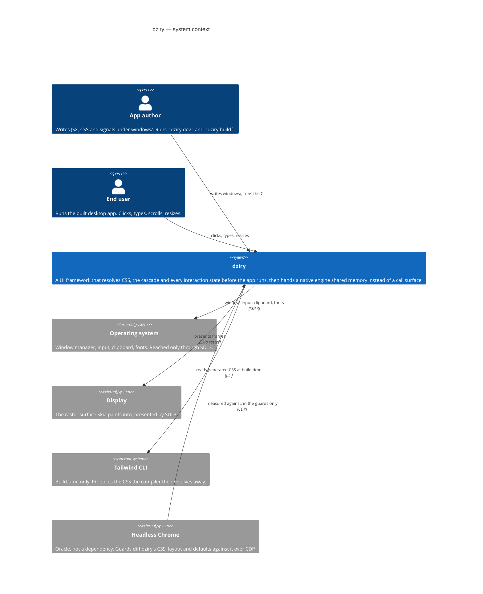

# Context

> Generated by `bun run arch-diagram`. Do not edit — regenerate.

Who uses dziry and what it touches. Note where Chrome sits: it is an oracle the guards measure against, not something the framework depends on.

