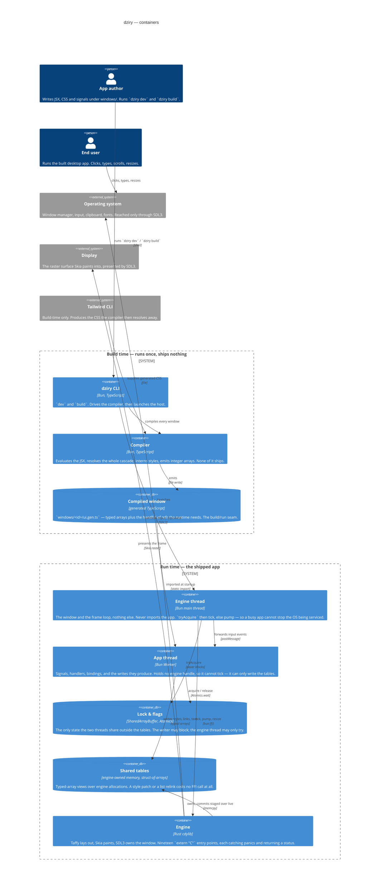

# Containers

> Generated by `bun run arch-diagram`. Do not edit — regenerate.

The processes, threads and memory the system is made of. The build/run split is the whole design: everything above the line runs once and ships nothing.

## What each one is

- **dziry CLI** *(Bun, TypeScript, build time)* — `dev` and `build`. Drives the compiler, then launches the host.
   `src/cli/index.ts`, `src/cli/build.ts`
- **Compiler** *(Bun, TypeScript, build time)* — Evaluates the JSX, resolves the whole cascade, interns styles, emits integer arrays. None of it ships.
   `src/compiler/build.ts`, `src/compiler/compile.ts`, `src/ir.ts`
- **Compiled window** *(generated TypeScript, build time)* — `windows/<id>/ui.gen.ts` — typed arrays plus the handful of refs the runtime needs. The build/run seam.
   `src/compiler/compile.ts`
- **Engine thread** *(Bun main thread, run time)* — The window and the frame loop, nothing else. Never imports the app. `tryAcquire` then tick, else pump — so a busy app cannot stop the OS being serviced.
   `src/host/main.ts`
- **App thread** *(Bun Worker, run time)* — Signals, handlers, bindings, and the writes they produce. Holds no engine handle, so it cannot tick — it can only write the tables.
   `src/host/worker.ts`, `src/runtime/signal.ts`
- **Lock & flags** *(SharedArrayBuffer, Atomics, run time)* — The only state the two threads share outside the tables. The writer may block; the engine thread may only try.
   `src/host/channel.ts`
- **Shared tables** *(engine-owned memory, struct-of-arrays, run time)* — Typed-array views over engine allocations. A style patch or a list relink costs no FFI call at all.
   `src/engine/upload.ts`, `native-src/dziry-engine/src/tables.rs`
- **Engine** *(Rust cdylib, run time)* — Taffy lays out, Skia paints, SDL3 owns the window. Nineteen `extern "C"` entry points, each catching panics and returning a status.
   `native-src/dziry-engine/src/lib.rs`, `native-src/dziry-engine/src/engine.rs`
