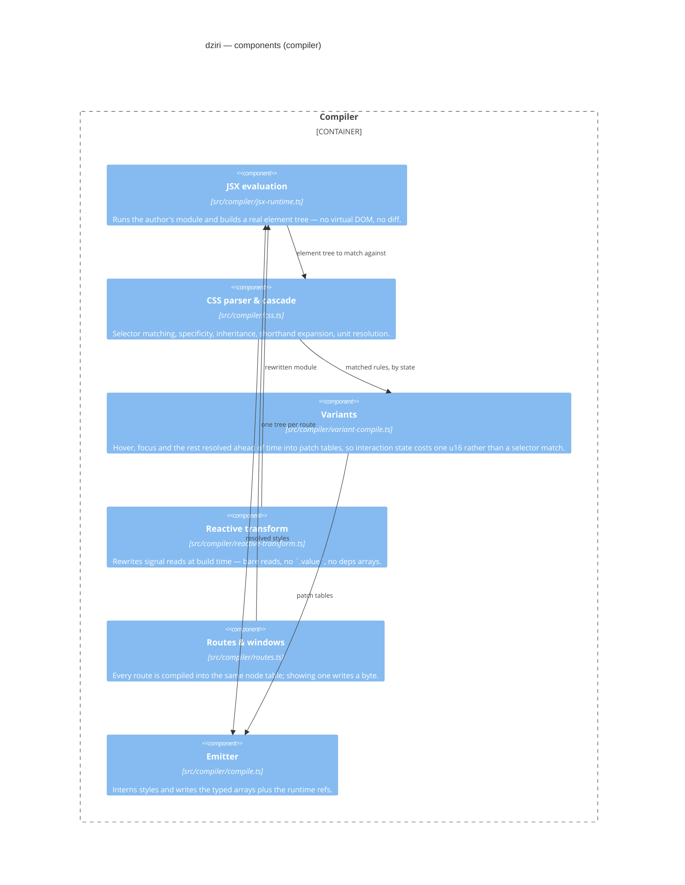
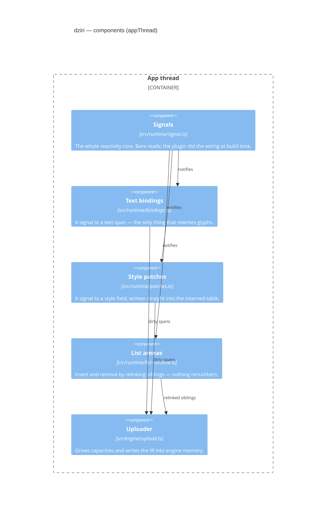
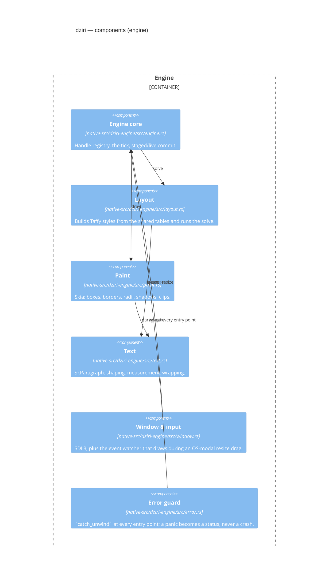

# Components

> Generated by `bun run arch-diagram`. Do not edit — regenerate.

Inside the three containers with enough moving parts to be worth opening: the compiler, the app thread, and the engine.

## Compiler

## App thread

## Engine

