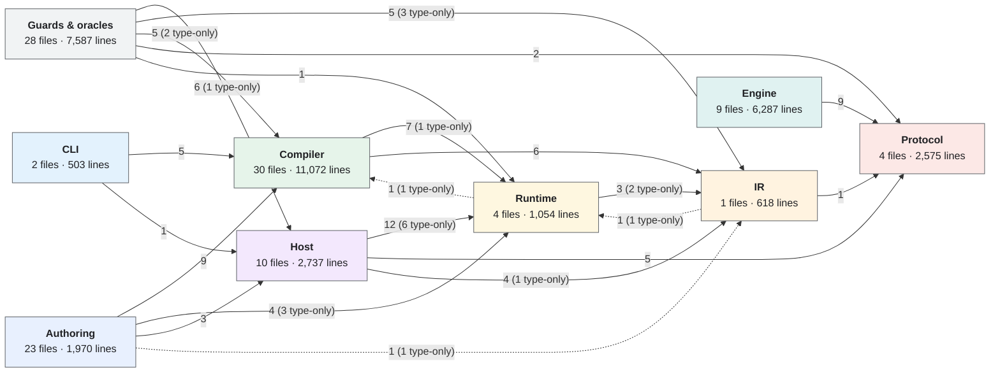

# Layers

> Generated by `bun run arch-diagram`. Do not edit — regenerate.

Level 4, derived. Every edge is a real import counted from the source; dashed edges are type-only and disappear at run time. Test files are excluded — they reach across layers on purpose.

## What each layer is

- **Authoring** — What a person writes: JSX, a stylesheet, module-level signals. None of it ships — the compiler evaluates it and keeps only the result.
   `windows/`
- **CLI** — The driver: `dev` and `build`. Not the compiler — it is the one build-time piece allowed to know about the host, because `build` embeds the engine binary.
   `src/cli/`
- **Compiler** — Selector matching, specificity, cascade, inheritance, shorthand expansion, unit resolution and interning — all at build time, ending in integer arrays.
   `src/compiler/`, `src/compile.ts`, `src/compile-window.ts`, `src/variants.ts`, `src/routes.ts`, `src/route-chain.test.ts`, `src/index.ts`
- **IR** — The build/run contract: the shape the compiler emits and the runtime and host read. One file, and the highest fan-in in the repo — which is why it gets its own layer rather than hiding inside the compiler.
   `src/ir.ts`
- **Runtime** — The only code that survives to run time: signals, and the three things they drive — text bindings, style patches, list arenas. No parser, no cascade, no tree diff.
   `src/runtime/`
- **Protocol** — One schema generates both sides' field identities; the engine reports byte offsets at run time. Everything else is a direct write into shared memory.
   `src/protocol/`, `native-src/dziri-engine/src/protocol.rs`, `native-src/dziri-engine/src/tables.rs`
- **Host** — Loads a compiled window, uploads it, dispatches input. Two threads — the engine thread that must never block, and the app thread that may.
   `src/host/`, `src/window-host.ts`, `src/engine/`
- **Engine** — Rust cdylib: Taffy lays out, Skia paints, SDL3 owns the window and input. Reads Bun-written memory as untrusted input and never lets a panic cross back.
   `native-src/dziri-engine/`
- **Guards & oracles** — The scripts that keep claims honest — Chrome as an oracle for CSS and layout, golden frames for paint, generated-vs-source checks for the protocol.
   `scripts/`, `native-src/skia-probe/`
