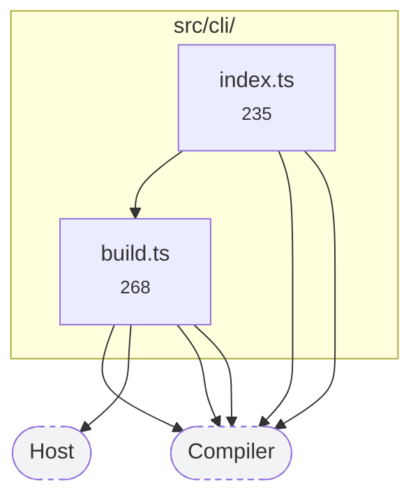
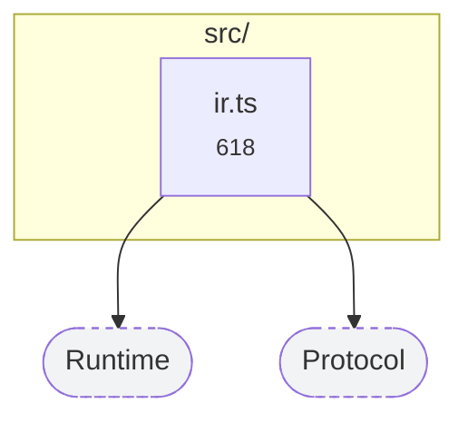
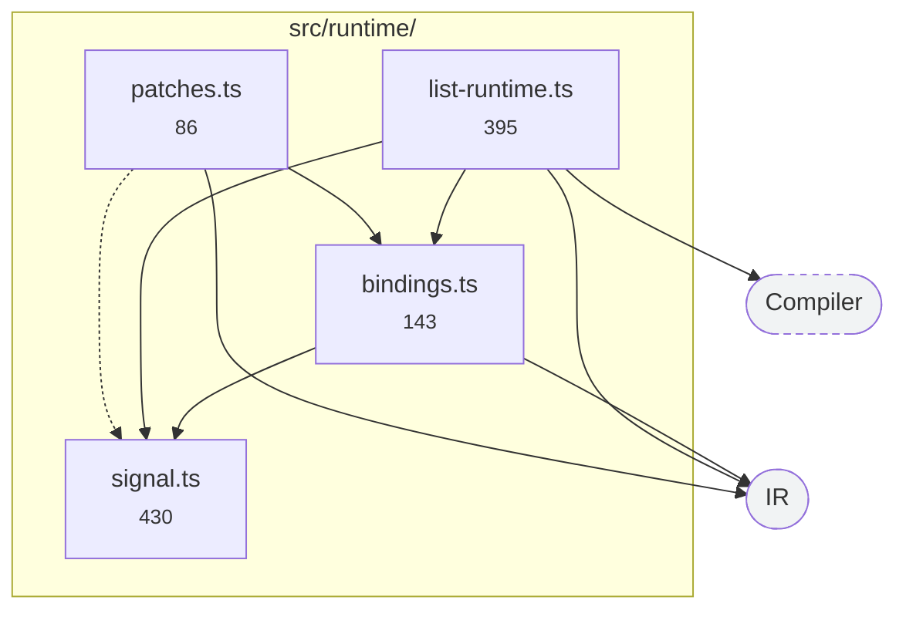
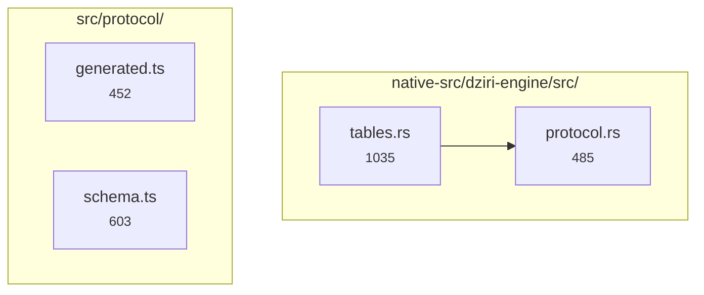
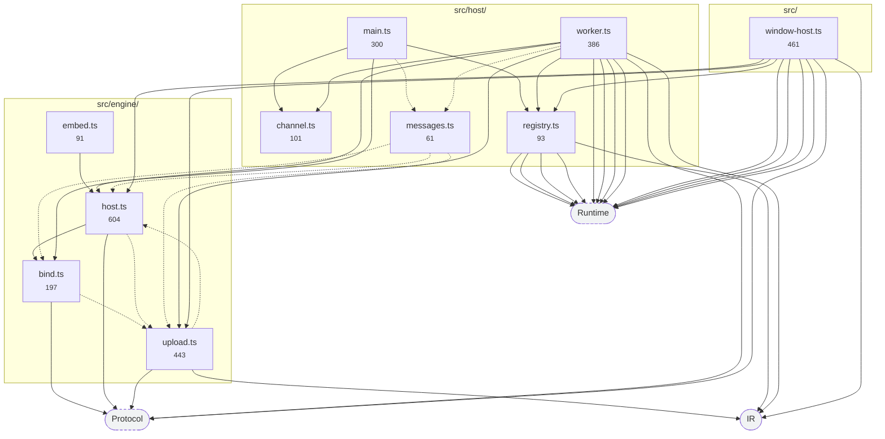
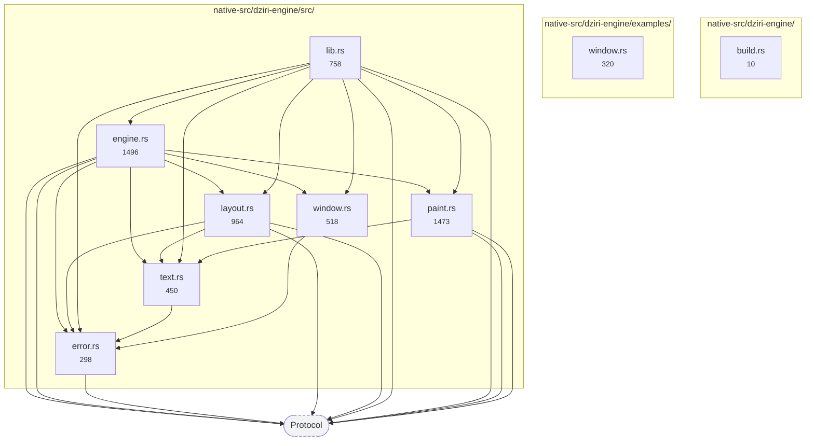

# Modules

> Generated by `bun run arch-diagram`. Do not edit — regenerate.

Every module in the repo, by layer, with the real import edges between them. Solid is a value import, dashed is type-only. Numbers under a name are lines.

## Authoring

```mermaid
flowchart TD
  subgraph windows["windows/"]
    windows_entry_gen_ts["entry.gen.ts<br/><small>14</small>"]
    windows_single_gen_ts["single.gen.ts<br/><small>9</small>"]
    windows_windows_gen_ts["windows.gen.ts<br/><small>14</small>"]
    windows_worker_gen_ts["worker.gen.ts<br/><small>8</small>"]
  end
  subgraph windows_main["windows/main/"]
    windows_main_coverage_gen_ts["coverage.gen.ts<br/><small>33</small>"]
    windows_main_index_tsx["index.tsx<br/><small>45</small>"]
    windows_main_Nav_tsx["Nav.tsx<br/><small>85</small>"]
    windows_main_reactivity_ts["reactivity.ts<br/><small>68</small>"]
    windows_main_router_ts["router.ts<br/><small>68</small>"]
    windows_main_state_ts["state.ts<br/><small>76</small>"]
    windows_main_ui_gen_ts["ui.gen.ts<br/><small>440</small>"]
  end
  subgraph windows_main_pages["windows/main/pages/"]
    windows_main_pages_borders_tsx["borders.tsx<br/><small>58</small>"]
    windows_main_pages_colors_tsx["colors.tsx<br/><small>70</small>"]
    windows_main_pages_controls_tsx["controls.tsx<br/><small>186</small>"]
    windows_main_pages_features_tsx["features.tsx<br/><small>202</small>"]
    windows_main_pages_index_tsx["index.tsx<br/><small>75</small>"]
    windows_main_pages_layout_tsx["layout.tsx<br/><small>56</small>"]
    windows_main_pages_products_tsx["products.tsx<br/><small>49</small>"]
    windows_main_pages_reactivity_tsx["reactivity.tsx<br/><small>253</small>"]
    windows_main_pages_spacing_tsx["spacing.tsx<br/><small>61</small>"]
    windows_main_pages_typography_tsx["typography.tsx<br/><small>54</small>"]
  end
  subgraph windows_main_pages_products["windows/main/pages/products/"]
    windows_main_pages_products__id_tsx["$id.tsx<br/><small>29</small>"]
    windows_main_pages_products_new_tsx["new.tsx<br/><small>17</small>"]
  end

  windows_main_index_tsx --> windows_main_Nav_tsx
  windows_main_index_tsx --> windows_main_router_ts
  windows_main_index_tsx --> windows_main_state_ts
  windows_main_Nav_tsx --> windows_main_router_ts
  windows_main_pages_features_tsx --> windows_main_state_ts
  windows_main_pages_index_tsx --> windows_main_coverage_gen_ts
  windows_main_pages_products_tsx --> windows_main_router_ts
  windows_main_pages_reactivity_tsx --> windows_main_reactivity_ts
  windows_main_ui_gen_ts --> windows_main_state_ts
  windows_main_ui_gen_ts --> windows_main_router_ts
  windows_main_ui_gen_ts --> windows_main_reactivity_ts
  windows_single_gen_ts --> windows_windows_gen_ts
  windows_windows_gen_ts --> windows_main_ui_gen_ts
  windows_worker_gen_ts --> windows_windows_gen_ts

  ext_host(["Host"])
  style ext_host fill:#f1f3f4,stroke-dasharray: 4 4
  ext_compiler(["Compiler"])
  style ext_compiler fill:#f1f3f4,stroke-dasharray: 4 4
  ext_runtime(["Runtime"])
  style ext_runtime fill:#f1f3f4,stroke-dasharray: 4 4
  ext_ir(["IR"])
  style ext_ir fill:#f1f3f4,stroke-dasharray: 4 4
  windows_entry_gen_ts --> ext_host
  windows_main_index_tsx --> ext_compiler
  windows_main_Nav_tsx --> ext_compiler
  windows_main_pages_features_tsx --> ext_compiler
  windows_main_pages_products__id_tsx --> ext_compiler
  windows_main_pages_products_tsx --> ext_compiler
  windows_main_pages_reactivity_tsx --> ext_compiler
  windows_main_reactivity_ts --> ext_compiler
  windows_main_router_ts --> ext_compiler
  windows_main_state_ts --> ext_compiler
  windows_main_ui_gen_ts --> ext_runtime
  windows_main_ui_gen_ts --> ext_ir
  windows_main_ui_gen_ts --> ext_runtime
  windows_main_ui_gen_ts --> ext_runtime
  windows_main_ui_gen_ts --> ext_runtime
  windows_single_gen_ts --> ext_host
  windows_worker_gen_ts --> ext_host
```

## CLI

## Compiler

```mermaid
flowchart TD
  subgraph src["src/"]
    src_compile_window_ts["compile-window.ts<br/><small>39</small>"]
    src_compile_ts["compile.ts<br/><small>273</small>"]
    src_index_ts["index.ts<br/><small>44</small>"]
    src_routes_ts["routes.ts<br/><small>80</small>"]
    src_variants_ts["variants.ts<br/><small>269</small>"]
  end
  subgraph src_compiler["src/compiler/"]
    src_compiler_build_ts["build.ts<br/><small>597</small>"]
    src_compiler_compile_ts["compile.ts<br/><small>2085</small>"]
    src_compiler_css_imports_ts["css-imports.ts<br/><small>155</small>"]
    src_compiler_css_ts["css.ts<br/><small>2342</small>"]
    src_compiler_html_ts["html.ts<br/><small>294</small>"]
    src_compiler_item_path_ts["item-path.ts<br/><small>116</small>"]
    src_compiler_jsx_dev_runtime_ts["jsx-dev-runtime.ts<br/><small>45</small>"]
    src_compiler_jsx_runtime_ts["jsx-runtime.ts<br/><small>637</small>"]
    src_compiler_reactive_plugin_ts["reactive-plugin.ts<br/><small>117</small>"]
    src_compiler_reactive_preload_ts["reactive-preload.ts<br/><small>63</small>"]
    src_compiler_reactive_runtime_ts["reactive-runtime.ts<br/><small>194</small>"]
    src_compiler_reactive_transform_ts["reactive-transform.ts<br/><small>548</small>"]
    src_compiler_resolve_refs_ts["resolve-refs.ts<br/><small>342</small>"]
    src_compiler_route_args_ts["route-args.ts<br/><small>185</small>"]
    src_compiler_route_ts["route.ts<br/><small>245</small>"]
    src_compiler_routes_ts["routes.ts<br/><small>428</small>"]
    src_compiler_sentinel_ts["sentinel.ts<br/><small>74</small>"]
    src_compiler_style_element_ts["style-element.ts<br/><small>72</small>"]
    src_compiler_stylesheet_ts["stylesheet.ts<br/><small>307</small>"]
    src_compiler_ua_sheet_ts["ua-sheet.ts<br/><small>84</small>"]
    src_compiler_ua_structure_ts["ua-structure.ts<br/><small>87</small>"]
    src_compiler_variant_compile_ts["variant-compile.ts<br/><small>471</small>"]
    src_compiler_variants_ts["variants.ts<br/><small>531</small>"]
    src_compiler_window_tree_ts["window-tree.ts<br/><small>188</small>"]
    src_compiler_window_ts["window.ts<br/><small>160</small>"]
  end

  src_compile_window_ts --> src_compiler_build_ts
  src_compile_ts --> src_compiler_compile_ts
  src_compile_ts --> src_compiler_css_ts
  src_compile_ts --> src_compiler_css_imports_ts
  src_compile_ts --> src_compiler_stylesheet_ts
  src_compile_ts --> src_compiler_style_element_ts
  src_compile_ts --> src_compiler_resolve_refs_ts
  src_compile_ts --> src_compiler_variant_compile_ts
  src_compile_ts --> src_compiler_jsx_runtime_ts
  src_compile_ts --> src_compiler_html_ts
  src_compiler_build_ts --> src_compiler_compile_ts
  src_compiler_build_ts --> src_compiler_css_ts
  src_compiler_build_ts --> src_compiler_css_imports_ts
  src_compiler_build_ts --> src_compiler_stylesheet_ts
  src_compiler_build_ts --> src_compiler_resolve_refs_ts
  src_compiler_build_ts --> src_compiler_variant_compile_ts
  src_compiler_build_ts --> src_compiler_jsx_runtime_ts
  src_compiler_build_ts --> src_compiler_routes_ts
  src_compiler_build_ts --> src_compiler_route_ts
  src_compiler_build_ts --> src_compiler_window_ts
  src_compiler_build_ts --> src_compiler_window_tree_ts
  src_compiler_build_ts --> src_compiler_reactive_plugin_ts
  src_compiler_build_ts --> src_compiler_reactive_runtime_ts
  src_compiler_build_ts -.-> src_compiler_html_ts
  src_compiler_compile_ts --> src_compiler_html_ts
  src_compiler_compile_ts --> src_compiler_item_path_ts
  src_compiler_compile_ts --> src_compiler_route_args_ts
  src_compiler_compile_ts --> src_compiler_reactive_runtime_ts
  src_compiler_compile_ts --> src_compiler_variant_compile_ts
  src_compiler_compile_ts --> src_compiler_css_ts
  src_compiler_compile_ts --> src_compiler_ua_sheet_ts
  src_compiler_compile_ts --> src_compiler_ua_structure_ts
  src_compiler_item_path_ts --> src_compiler_sentinel_ts
  src_compiler_jsx_dev_runtime_ts --> src_compiler_jsx_runtime_ts
  src_compiler_jsx_dev_runtime_ts -.-> src_compiler_html_ts
  src_compiler_jsx_runtime_ts --> src_compiler_item_path_ts
  src_compiler_jsx_runtime_ts --> src_compiler_route_args_ts
  src_compiler_jsx_runtime_ts -.-> src_compiler_html_ts
  src_compiler_reactive_plugin_ts --> src_compiler_compile_ts
  src_compiler_reactive_plugin_ts --> src_compiler_reactive_transform_ts
  src_compiler_reactive_preload_ts --> src_compiler_reactive_plugin_ts
  src_compiler_resolve_refs_ts -.-> src_compiler_compile_ts
  src_compiler_resolve_refs_ts --> src_compiler_route_ts
  src_compiler_resolve_refs_ts --> src_compiler_reactive_runtime_ts
  src_compiler_route_args_ts --> src_compiler_sentinel_ts
  src_compiler_route_ts --> src_compiler_route_args_ts
  src_compiler_routes_ts --> src_compiler_route_args_ts
  src_compiler_style_element_ts -.-> src_compiler_html_ts
  src_compiler_stylesheet_ts --> src_compiler_css_ts
  src_compiler_ua_structure_ts -.-> src_compiler_html_ts
  src_compiler_variant_compile_ts --> src_compiler_compile_ts
  src_compiler_variant_compile_ts -.-> src_compiler_html_ts
  src_compiler_variants_ts --> src_compiler_compile_ts
  src_compiler_variants_ts -.-> src_compiler_html_ts
  src_compiler_window_tree_ts -.-> src_compiler_html_ts
  src_compiler_window_tree_ts --> src_compiler_window_ts
  src_compiler_window_ts --> src_compiler_jsx_runtime_ts
  src_compiler_window_ts -.-> src_compiler_html_ts
  src_index_ts --> src_compiler_jsx_runtime_ts
  src_index_ts --> src_compiler_window_ts
  src_index_ts --> src_compiler_route_ts
  src_routes_ts --> src_compiler_routes_ts
  src_variants_ts --> src_compiler_jsx_runtime_ts
  src_variants_ts --> src_compiler_html_ts
  src_variants_ts --> src_compiler_variants_ts
  src_variants_ts --> src_compiler_compile_ts
  src_variants_ts --> src_compiler_variant_compile_ts
  src_variants_ts --> src_compiler_stylesheet_ts

  ext_runtime(["Runtime"])
  style ext_runtime fill:#f1f3f4,stroke-dasharray: 4 4
  ext_ir(["IR"])
  style ext_ir fill:#f1f3f4,stroke-dasharray: 4 4
  src_compile_ts --> ext_runtime
  src_compiler_build_ts --> ext_runtime
  src_compiler_build_ts --> ext_ir
  src_compiler_compile_ts --> ext_ir
  src_compiler_css_ts --> ext_ir
  src_compiler_jsx_runtime_ts --> ext_runtime
  src_compiler_reactive_runtime_ts --> ext_runtime
  src_compiler_route_ts --> ext_runtime
  src_compiler_variant_compile_ts --> ext_ir
  src_compiler_variants_ts --> ext_ir
  src_compiler_window_ts --> ext_ir
  src_compiler_window_ts --> ext_runtime
  src_index_ts --> ext_runtime
```

## IR

## Runtime

## Protocol

## Host

## Engine

## Guards & oracles

```mermaid
flowchart TD
  subgraph native_src_skia_probe["native-src/skia-probe/"]
    native_src_skia_probe_build_rs["build.rs<br/><small>10</small>"]
  end
  subgraph native_src_skia_probe_src["native-src/skia-probe/src/"]
    native_src_skia_probe_src_main_rs["main.rs<br/><small>82</small>"]
  end
  subgraph scripts["scripts/"]
    scripts_arch_diagram_ts["arch-diagram.ts<br/><small>1148</small>"]
    scripts_bench_ts["bench.ts<br/><small>364</small>"]
    scripts_boundary_diff_ts["boundary-diff.ts<br/><small>213</small>"]
    scripts_cdp_ts["cdp.ts<br/><small>256</small>"]
    scripts_characterize_ts["characterize.ts<br/><small>158</small>"]
    scripts_conformance_ts["conformance.ts<br/><small>343</small>"]
    scripts_coverage_snapshot_ts["coverage-snapshot.ts<br/><small>121</small>"]
    scripts_css_coverage_ts["css-coverage.ts<br/><small>232</small>"]
    scripts_doc_lint_ts["doc-lint.ts<br/><small>79</small>"]
    scripts_docs_check_ts["docs-check.ts<br/><small>366</small>"]
    scripts_gen_protocol_ts["gen-protocol.ts<br/><small>403</small>"]
    scripts_golden_ts["golden.ts<br/><small>188</small>"]
    scripts_html_coverage_ts["html-coverage.ts<br/><small>388</small>"]
    scripts_layout_diff_ts["layout-diff.ts<br/><small>540</small>"]
    scripts_mdn_sync_ts["mdn-sync.ts<br/><small>77</small>"]
    scripts_probe_server_ts["probe-server.ts<br/><small>77</small>"]
    scripts_probe_ts["probe.ts<br/><small>255</small>"]
    scripts_protocol_guard_ts["protocol-guard.ts<br/><small>176</small>"]
    scripts_runtime_surface_ts["runtime-surface.ts<br/><small>177</small>"]
    scripts_signals_tsx["signals.tsx<br/><small>286</small>"]
    scripts_spec_audit_ts["spec-audit.ts<br/><small>225</small>"]
    scripts_tailwind_coverage_ts["tailwind-coverage.ts<br/><small>341</small>"]
    scripts_template_sync_ts["template-sync.ts<br/><small>108</small>"]
  end
  subgraph scripts_hooks["scripts/hooks/"]
    scripts_hooks_after_edit_ts["after-edit.ts<br/><small>123</small>"]
  end
  subgraph scripts_lib["scripts/lib/"]
    scripts_lib_arch_model_ts["arch-model.ts<br/><small>638</small>"]
    scripts_lib_citations_ts["citations.ts<br/><small>213</small>"]
  end

  scripts_arch_diagram_ts --> scripts_lib_arch_model_ts
  scripts_conformance_ts --> scripts_cdp_ts
  scripts_doc_lint_ts --> scripts_lib_citations_ts
  scripts_html_coverage_ts --> scripts_cdp_ts
  scripts_layout_diff_ts --> scripts_cdp_ts
  scripts_probe_ts --> scripts_probe_server_ts

  ext_protocol(["Protocol"])
  style ext_protocol fill:#f1f3f4,stroke-dasharray: 4 4
  ext_ir(["IR"])
  style ext_ir fill:#f1f3f4,stroke-dasharray: 4 4
  ext_host(["Host"])
  style ext_host fill:#f1f3f4,stroke-dasharray: 4 4
  ext_runtime(["Runtime"])
  style ext_runtime fill:#f1f3f4,stroke-dasharray: 4 4
  ext_compiler(["Compiler"])
  style ext_compiler fill:#f1f3f4,stroke-dasharray: 4 4
  scripts_arch_diagram_ts --> ext_protocol
  scripts_bench_ts --> ext_ir
  scripts_bench_ts --> ext_host
  scripts_bench_ts --> ext_host
  scripts_boundary_diff_ts --> ext_ir
  scripts_boundary_diff_ts --> ext_host
  scripts_boundary_diff_ts --> ext_host
  scripts_gen_protocol_ts --> ext_protocol
  scripts_html_coverage_ts --> ext_ir
  scripts_layout_diff_ts --> ext_ir
  scripts_layout_diff_ts --> ext_host
  scripts_layout_diff_ts --> ext_host
  scripts_signals_tsx --> ext_runtime
  scripts_signals_tsx --> ext_compiler
  scripts_signals_tsx --> ext_compiler
  scripts_signals_tsx --> ext_compiler
  scripts_signals_tsx --> ext_compiler
  scripts_signals_tsx --> ext_compiler
  scripts_spec_audit_ts --> ext_ir
```

