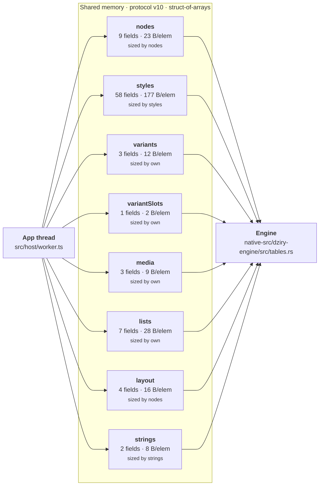

# The shared-memory boundary

> Generated by `bun run arch-diagram`. Do not edit — regenerate.

Read directly from `src/protocol/schema.ts`, so it cannot disagree with the protocol. Version 10.

| Table | Fields | Bytes/elem | Sized by |
| --- | --- | --- | --- |
| `nodes` | 9 | 23 | nodes |
| `styles` | 58 | 177 | styles |
| `variants` | 3 | 12 | own |
| `variantSlots` | 1 | 2 | own |
| `media` | 3 | 9 | own |
| `lists` | 7 | 28 | own |
| `layout` | 4 | 16 | nodes |
| `strings` | 2 | 8 | strings |
