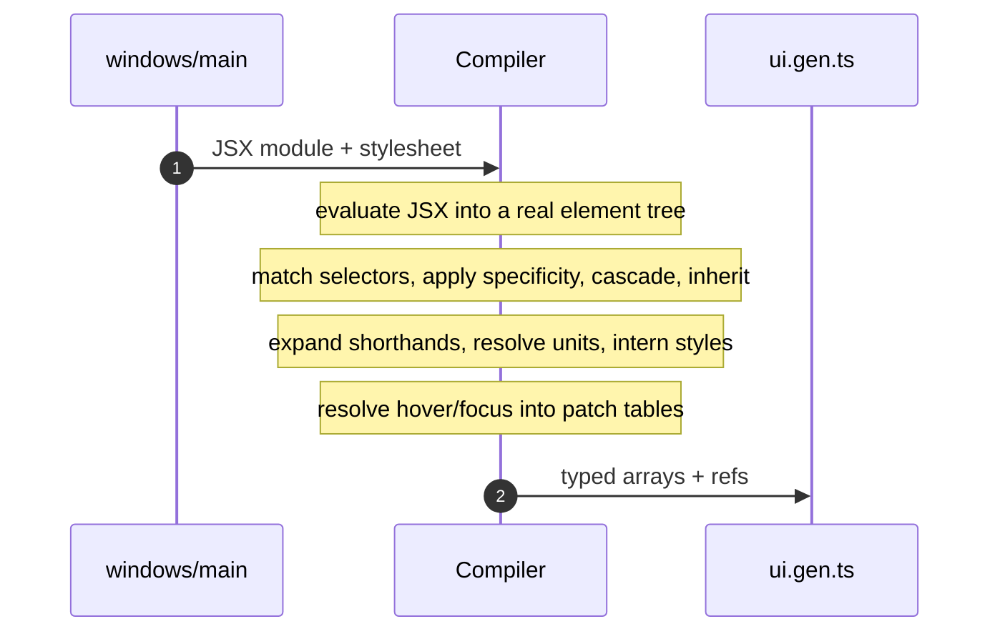
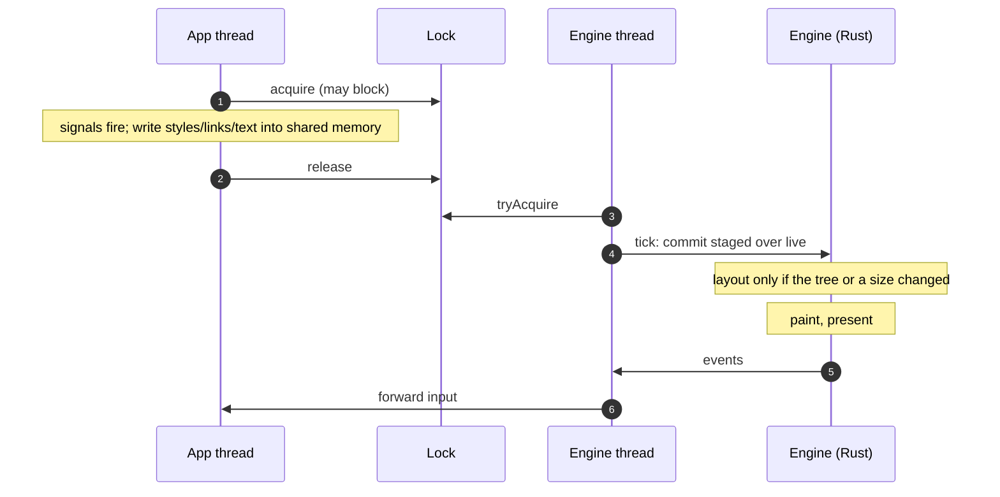
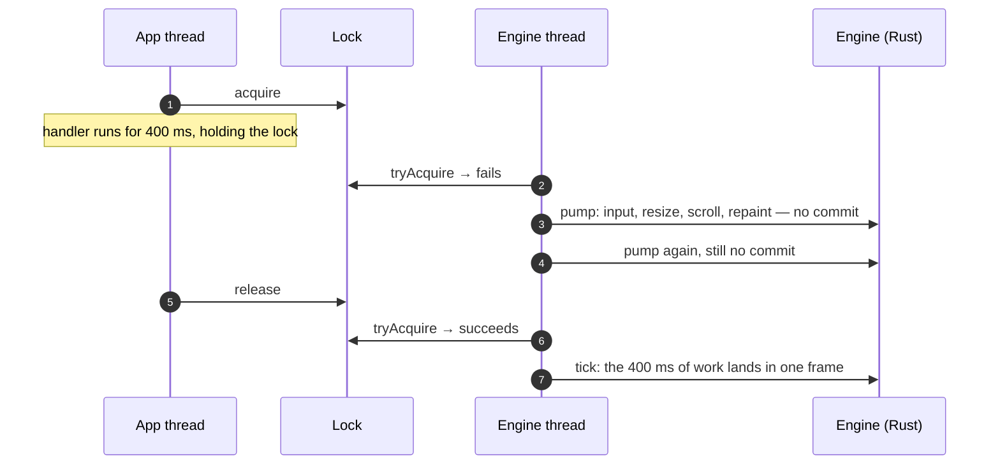

# Flows

> Generated by `bun run arch-diagram`. Do not edit — regenerate.

The sequences that are easier to watch than to read.

## One div, end to end

*What has already happened by the time you reach the boundary?*

## The frame loop

*What does a frame cost, and what does an idle one cost?*

## A handler that takes 400 ms

*Why does a busy app no longer freeze the window?*

